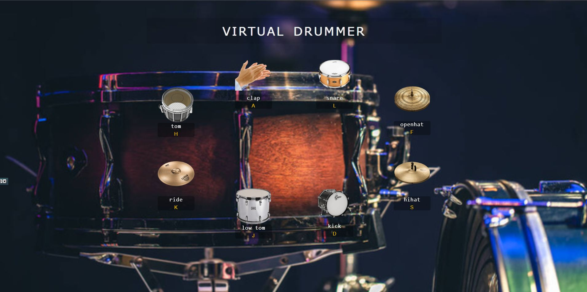

# Virtual Drummer

If you like play drums this is something for you! :). I made this
project as a solution for challenge in one of the Java Script Course
(though I use Type Script here). The main case is to practice
KeyboardEvent, css staff like flex, transform, clamp or calc. Enjoy
playing virtual drummer :).

  

